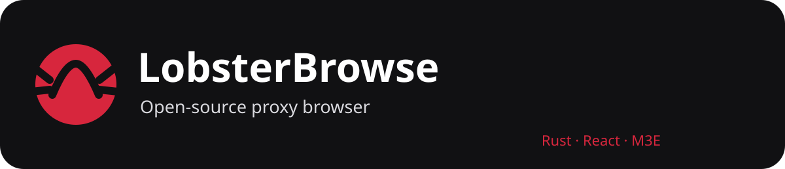

# LobsterBrowse

**Open-source proxy browser · Rust + React + Material 3 Expressive**
LobsterBrowse is a browser-style proxy application built around Rust/Axum, React/M3E, Wisp transport, structured DevTools diagnostics and Zeolite integration.
## Architecture
    LobsterBrowse UI
          |
    +-----+------+
    |            |
  /r + /lj     Zeolite
  rewriting     engine
    |            |
    +---- Wisp--+
           |
        upstream
## Server
- server/bin/server — Tokio + Axum HTTP/WSS entrypoint.
- server/crates/adblock — network filtering.
- /r/<base64url target> — server-side rewriting.
- /lj/<base64url target> — legacy /lj server handler.
- /wisp/ — Wisp endpoint.
- /logs — bounded diagnostics.
- /healthz — liveness.
- /zlsw/ — published Zeolite bundle.
- /zl-ext/ and /zl-cs/ — extension routes.
- /suggest — search suggestion proxy.
## UI
React + TypeScript + Vite with Material 3 Expressive components. Includes tabs, settings, incognito sessions, DevTools, site information, extension controls, search suggestions, link prefetch and the retained /lj cache worker.
## Zeolite integration
Zeolite is maintained separately so other host applications can reuse it. LobsterBrowse consumes its published bundle under /zlsw/ without making Zeolite depend on LobsterBrowse UI code.
## NativeTransit direction
NativeTransit is the next transport/interception architecture:
    LobsterBrowse -> Zeolite -> Transport
                              |-> NativeTransit
                              |-> RewriteFallback -> Wisp -> Network
> Do not rewrite website content unless the engine needs to.
This is a design direction, not a claim that NativeTransit has already replaced rewriting. Do not remove the existing rewriting engine until compatibility tests demonstrate that it is no longer needed.
When implemented, DevTools should show transport path, NativeTransit vs RewriteFallback, fallback reason, and whether a failure is upstream, transport, browser/runtime, policy or rewriting related.
## Current rewriting behavior
The server path handles URL-bearing HTML attributes, CSS url()/@import, srcset and inline styles, plus runtime handling for fetch/XHR, URL-bearing element properties, history and window.open. Redirects are followed and relative URLs resolved against the final URL. Non-rewritable content streams without unnecessary buffering.
Known limitations include client-side cookie differences, limited service-worker behavior, WebSocket-heavy application gaps and complex SPA compatibility gaps.
## Proxy options
| Option | Purpose |
| --- | --- |
| lb_ab=1 | ad filtering |
| lb_trk=1 | tracker filtering |
| lb_https=1 | reject plain HTTP |
| lb_img=1 | JPEG re-encoding |
| lb_ua= | user-agent override |
## DevTools
DevTools is a real diagnostic surface. Events should identify trace/request ID, redacted URL, subsystem, severity, lifecycle stage and concrete cause where known. A normal WebSocket close is not an error. NativeTransit diagnostics should expose native-vs-fallback behavior.
## UI rules
No hamburger menu. The compact nav rail owns its sizing/overflow. Tabs shrink rather than horizontally scrolling. Toolbar URL editing remains inside the center pill. Bookmarks and the old nav-rail badge are intentionally removed. Settings are localStorage-backed and migration-safe.
## Privacy
LobsterBrowse is a proxy, so the server necessarily sees traffic it proxies. Do not describe it as server-blind. Browser UI state is stored locally. Diagnostics/logs must redact credentials, cookies, authorization data and other secrets.
## Building
cd server && cargo test && cargo build --release
cd ui && npm install && npm run build
## Deployment
The application is deployed on Render. After deployment changes verify /healthz, UI, /r/, /lj/, /zlsw/, Wisp and extension routes when relevant.
## Contributing
Inspect the implementation, trace the request/state flow, identify the correct repository boundary, make the smallest coherent change, run tests/builds, inspect the diff and update docs. If a fix belongs in Zeolite, fix it there instead of adding a LobsterBrowse-only workaround.
## Architecture goal
LobsterBrowse = host application + browser UI
Zeolite = reusable interception/transport engine
Wisp = transport foundation
RewriteFallback = compatibility escape hatch